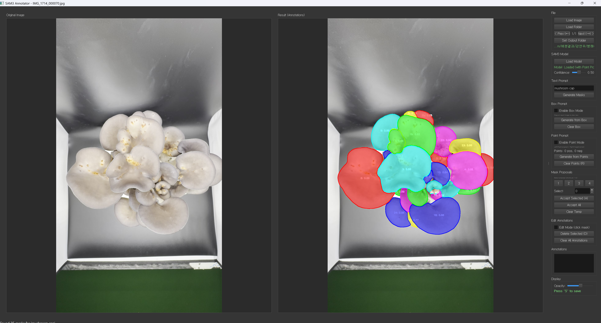

# SAM3 Annotator - 사용자 가이드

## 개요

SAM3 Annotator는 SAM3(Segment Anything Model 3)을 활용한 강력한 GUI 기반 어노테이션 도구입니다. 텍스트, 박스, 포인트 프롬프트 등 다양한 입력 방식을 사용하여 이미지 내 객체를 효율적으로 라벨링하고 어노테이션할 수 있습니다.



## 주요 기능

- **다중 프롬프트 지원**: 텍스트 설명, 바운딩 박스, 포인트 클릭을 사용한 객체 분할
- **인터랙티브 어노테이션**: 실시간 마스크 생성 및 정제
- **배치 처리**: 이미지 폴더 전체 로드 및 처리
- **COCO 형식 내보내기**: 표준 COCO JSON 형식으로 어노테이션 저장
- **듀얼 캔버스 뷰**: 원본 이미지와 어노테이션 결과 나란히 비교
- **다중 마스크 제안**: 여러 분할 후보 검토 및 선택
- **키보드 단축키**: 효율적인 작업 흐름을 위한 단축키 지원

---

## 설치


### SAM3 모델 설정

어노테이터는 인터랙티브 기능이 활성화된 SAM3 모델이 필요합니다. SAM3가 제대로 설치되었는지 확인하세요:

SAM3는 [링크](https://github.com/facebookresearch/sam3)에서 확인 가능합니다.

### Prerequisites

- Python 3.12 or higher
- PyTorch 2.7 or higher
- CUDA-compatible GPU with CUDA 12.6 or higher

1. **Create a new Conda environment:**

```bash
conda create -n sam3 python=3.12
conda deactivate
conda activate sam3
```

2. **Install PyTorch with CUDA support:**

```bash
pip install torch==2.7.0 torchvision torchaudio --index-url https://download.pytorch.org/whl/cu126
```

3. **Clone the repository and install the package:**

```bash
git clone https://github.com/facebookresearch/sam3.git
cd sam3
pip install -e .
pip install PyQt5 
```

4. **Install additional dependencies for example notebooks or development:**

```bash
# For running example notebooks
pip install -e ".[notebooks]"
```

5. **Install annotator**
```bash
move ../annotator.py ./sam3/
```

---

## 시작하기

### 1. 어노테이터 실행

명령줄에서 어노테이터를 실행합니다:

```bash
python annotator.py
```

### 2. SAM3 모델 로드

1. SAM3 Model 섹션에서 **"Load Model"** 버튼 클릭
2. 모델이 로드될 때까지 대기 (몇 분 소요될 수 있음)
3. 준비되면 상태가 **Model: Loaded (with Point Prompt)** 로 표시됨

> **참고**: 포인트 프롬프트를 지원하기 위해 모델은 `enable_inst_interactivity=True`로 로드됩니다.

### 3. 이미지 로드

다음 옵션 중 하나를 선택하세요:

- **단일 이미지**: "Load Image"를 클릭하여 이미지 파일 하나 선택
- **폴더**: "Load Folder"를 클릭하여 디렉토리의 모든 이미지 로드

지원 형식: PNG, JPG, JPEG, BMP, TIFF

### 4. 출력 폴더 설정

**Set Output Folder**를 클릭하여 어노테이션이 저장될 위치를 지정합니다. 폴더를 로드하면 출력 폴더가 자동으로 동일한 디렉토리로 설정됩니다(변경 가능).

---

## 어노테이션 방법

### 방법 1: 텍스트 프롬프트

자연어 설명을 사용하여 마스크를 생성합니다.

1. **Text Prompt** 필드에 설명 입력 (예: "버섯 갓", "사람", "강아지")
2. **Enter** 키를 누르거나 **"Generate Masks"** 클릭
3. 결과 캔버스에 오버레이된 생성된 마스크 검토
4. 선택기 또는 단축키(1-4)를 사용하여 원하는 마스크 선택
5. **"A"**(Accept)를 눌러 확인

**사용 사례**: 뚜렷한 특징을 가진 명확하게 정의된 객체의 빠른 어노테이션

---

### 방법 2: 박스 프롬프트

바운딩 박스를 그려 특정 영역 내 객체를 분할합니다.

1. **"Enable Box Mode"** 체크
2. **결과 캔버스**에서 클릭 및 드래그하여 바운딩 박스 그리기
3. (선택사항) 더 나은 결과를 위해 텍스트 설명 입력
4. **"Generate from Box"** 클릭
5. 제안된 마스크를 검토하고 **A**를 눌러 수락

**사용 사례**: 정밀한 영역 특정 분할, 특히 겹치거나 밀집된 객체에 유용

---

### 방법 3: 포인트 프롬프트

객체를 직접 클릭하여 분할을 안내합니다.

1. **"Enable Point Mode"** 체크
2. 객체에 **왼쪽 클릭**하여 긍정 포인트 추가 (녹색 마커)
3. 배경에 **오른쪽 클릭**하여 부정 포인트 추가 (빨간색 마커)
4. 포인트 추가 후 **"Generate from Points"** 클릭
5. 최대 4개의 마스크 제안 검토 (점수와 함께 표시됨)
6. **1-4** 키를 눌러 제안 간 전환
7. **A**를 눌러 선택한 마스크 수락

**사용 사례**: 복잡하거나 모호한 객체에 대한 세밀한 제어

**팁**:
- 객체 중앙에 하나의 긍정 클릭으로 시작
- 원하지 않는 영역을 제외하기 위해 부정 클릭 추가
- 불규칙한 형태에는 여러 긍정 클릭 사용
- **"R"**(Reject)을 눌러 포인트를 지우고 다시 시작

---

## 마스크 작업

### 제안 검토

마스크 생성 후 여러 제안을 볼 수 있습니다:

- 마스크는 서로 다른 색상으로 표시됨
- 각 마스크는 신뢰도 점수를 표시 (예: "0: 0.95")
- **Mask Selector** 스피너 또는 **단축키 1-4**를 사용하여 제안 순환

### 마스크 수락

- **Accept Selected (A)**: 현재 선택된 마스크를 어노테이션에 추가
- **Accept All**: 생성된 모든 마스크를 동일한 라벨로 추가
- **Clear Temp**: 저장하지 않고 임시 마스크 제거

### 어노테이션 관리

**Annotation List**: 라벨 및 점수와 함께 확인된 모든 어노테이션 표시

- **Edit Mode**: "Edit Mode"를 체크하고 마스크를 클릭하여 편집/삭제
- 리스트의 어노테이션을 **더블 클릭**하여 라벨 수정
- **Delete Selected (D)**: 현재 선택된 어노테이션 제거
- **Clear All Annotations**: 현재 이미지의 모든 어노테이션 제거

---

## 키보드 단축키

| 키 | 동작 |
|-----|--------|
| **S** | 출력 폴더에 어노테이션 빠른 저장 |
| **A** | 선택된 마스크 수락 |
| **R** | 모든 임시 마스크 거부 및 프롬프트 지우기 |
| **D** | 선택된 어노테이션 삭제 |
| **1-4** | 마스크 제안 1-4 선택 |
| **← / →** | 이전/다음 이미지로 이동 |

---

## 디스플레이 컨트롤

### 투명도 슬라이더
마스크 투명도(0-100%)를 조정하여 하위 이미지 세부 사항을 더 잘 시각화합니다.

### 줌
**마우스 휠**을 사용하여 원본 및 결과 캔버스 각각에서 독립적으로 확대/축소합니다.

### 신뢰도 임계값
신뢰도 슬라이더(0.01-0.99)를 조정하여 낮은 신뢰도의 마스크를 필터링합니다. 낮은 값은 더 많은 제안을 표시합니다.

---

## 어노테이션 저장

### 빠른 저장 (권장)
**S**를 눌러 현재 이미지의 어노테이션을 즉시 저장합니다.

### 수동 저장
출력 폴더가 설정된 경우 다음 이미지로 이동할 때 어노테이션이 자동으로 저장됩니다.

### 출력 형식

어노테이션은 **COCO JSON 형식**으로 저장됩니다:

```json
{
  "info": {
    "description": "SAM3 Annotator Export",
    "date_created": "2024-11-23T10:30:00",
    "version": "1.0"
  },
  "images": [{
    "id": 1,
    "file_name": "image001.jpg",
    "width": 1920,
    "height": 1080
  }],
  "categories": [{
    "id": 1,
    "name": "mushroom_cap",
    "supercategory": ""
  }],
  "annotations": [{
    "id": 1,
    "image_id": 1,
    "category_id": 1,
    "segmentation": [[x1, y1, x2, y2, ...]],
    "area": 12345.0,
    "bbox": [x, y, width, height],
    "iscrowd": 0
  }]
}
```

**파일 명명 규칙**: `{원본파일명}.json`

---

## 워크플로우

### 단일 객체 어노테이션
1. 이미지 및 모델 로드
2. 빠른 초기 분할을 위해 **텍스트 프롬프트** 사용
3. 필요시 **포인트 프롬프트**로 전환하여 정제
4. **A**를 눌러 수락
5. **S**를 눌러 저장

### 다중 객체 어노테이션
1. **박스 프롬프트**를 사용하여 영역 분리
2. 객체별로 구체적인 텍스트 설명 입력
3. 각 마스크를 개별적으로 수락
4. 필요시 어노테이션 리스트에서 라벨 편집
5. 다음 이미지로 이동하기 전 저장

### 복잡한 장면 어노테이션
1. 주요 객체에 대해 **텍스트 프롬프트**로 시작
2. 겹치는 영역에 **박스 프롬프트** 사용
3. **포인트 프롬프트**(긍정 + 부정)로 정제
4. 제안 점수 검토 (높을수록 좋음)
5. 만족할 때까지 반복

### 배치 처리 워크플로우
1. 이미지 폴더 로드
2. 출력 폴더 설정
3. 각 이미지에 대해:
   - 마스크 생성 (텍스트/박스/포인트)
   - 마스크 수락
   - **S** 누르기 (저장)
   - **→** 누르기 (다음 이미지)
4. 저장된 JSON 파일 검토

---

## 고급 기능

### 다중 마스크 제안
포인트 프롬프트 사용 시 SAM3는 최대 4개의 서로 다른 분할 제안을 생성합니다:
- **제안 1**: 일반적으로 가장 신뢰도가 높은 마스크
- **제안 2-4**: 대안적인 해석

숫자 키 **1-4**를 사용하여 빠르게 전환할 수 있습니다.

### 라벨 관리
- 라벨은 자동으로 카테고리 리스트에 추가됨
- 편집 대화 상자의 드롭다운에서 라벨 재사용
- 각 고유 라벨은 COCO 내보내기에서 고유한 카테고리 ID를 받음

### 마스크 정제
최상의 결과를 위해 여러 프롬프트 유형을 결합하세요:
1. **텍스트 프롬프트**로 시작
2. 마스크를 확장하기 위해 **긍정 포인트** 추가
3. 영역을 제외하기 위해 **부정 포인트** 추가
4. 정제하기 위해 다시 생성

---

## 기술 세부사항

### 마스크 표현
- 마스크는 이진 NumPy 배열(H × W)로 저장됨
- COCO 형식을 위해 폴리곤 좌표로 변환
- 면적 및 바운딩 박스는 자동으로 계산됨

### 성능 최적화
- 이미지 인코딩은 모델 로드 후 캐시됨
- 디스플레이 렌더링은 벡터화된 연산 사용
- 오버레이 캐싱으로 다시 그리기 시간 감소

### 추론 상태
어노테이터는 효율적인 재프롬프팅을 위해 추론 상태를 유지합니다:
- 이미지 특징은 이미지 로드당 한 번만 추출됨
- 텍스트/박스/포인트 프롬프트는 캐시된 특징에서 작동
- 새 이미지 로드 시 재설정

---

## 자주 묻는 질문 (FAQ)

**Q: 비디오를 어노테이션할 수 있나요?**  
A: 이 도구는 이미지 전용입니다. 비디오 어노테이션은 `sam3_video_predictor_example.ipynb`를 참조하세요.

**Q: COCO 외에 다른 형식으로 내보낼 수 있나요?**  
A: 현재 COCO JSON만 지원됩니다. JSON 파일의 마스크를 사용하여 변환할 수 있습니다.

**Q: 같은 클래스의 여러 인스턴스를 어노테이션하려면?**  
A: 박스/포인트 프롬프트를 사용하여 한 번에 하나씩 마스크를 생성하고, 각각 동일한 라벨 텍스트를 사용합니다.

**Q: 어노테이션을 취소할 수 있나요?**  
A: 예, Edit Mode를 사용하여 마스크를 클릭하고 삭제하거나 리스트에서 "Delete Selected"를 사용하세요.

**Q: 최대 이미지 크기는?**  
A: GPU 메모리에 의해 제한됩니다. 필요시 이미지가 자동으로 크기 조정됩니다. 매우 큰 이미지(>4K)의 경우 사전에 크기 조정을 고려하세요.

**Q: CPU만 사용할 수 있나요?**  
A: 예, 하지만 훨씬 느릴 것입니다. 모델은 사용 가능한 경우 자동으로 GPU를 사용합니다.

---

## 예시

### 예시 1: 버섯 어노테이션
```
1. 버섯 이미지 로드
2. 텍스트 프롬프트: "버섯 갓"
3. Enter 누르기 → 마스크 검토
4. "2"를 눌러 두 번째 제안 선택
5. "A"를 눌러 수락
6. 텍스트 프롬프트: "버섯 줄기"
7. 생성 및 수락
8. "S"를 눌러 저장
```

### 예시 2: 겹치는 객체
```
1. Box Mode 활성화
2. 첫 번째 객체 주변에 박스 그리기
3. 텍스트 입력: "사과"
4. 박스로부터 생성
5. "A"로 수락
6. 다른 객체에 대해 반복
7. "S"를 눌러 저장
```

### 예시 3: 세밀한 어노테이션
```
1. Point Mode 활성화
2. 객체 중앙에 왼쪽 클릭 (녹색)
3. 배경 영역에 오른쪽 클릭 (빨강)
4. 포인트로부터 생성
5. 1-4 키로 제안 검토
6. 최상의 마스크 선택
7. "A"를 눌러 수락
8. "R"을 눌러 다음 객체를 위해 포인트 지우기
```

---

## 기여하기

버그를 발견했거나 기능 요청이 있나요? GitHub 저장소에 이슈를 열어주세요.

---

## 라이센스

Copyright (c) 2024. SAM3 Annotator Tool.  
자세한 내용은 LICENSE 파일을 참조하세요.

---

